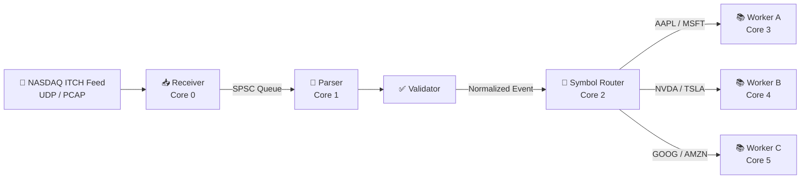
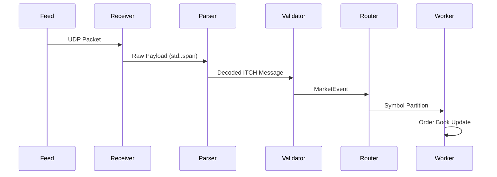
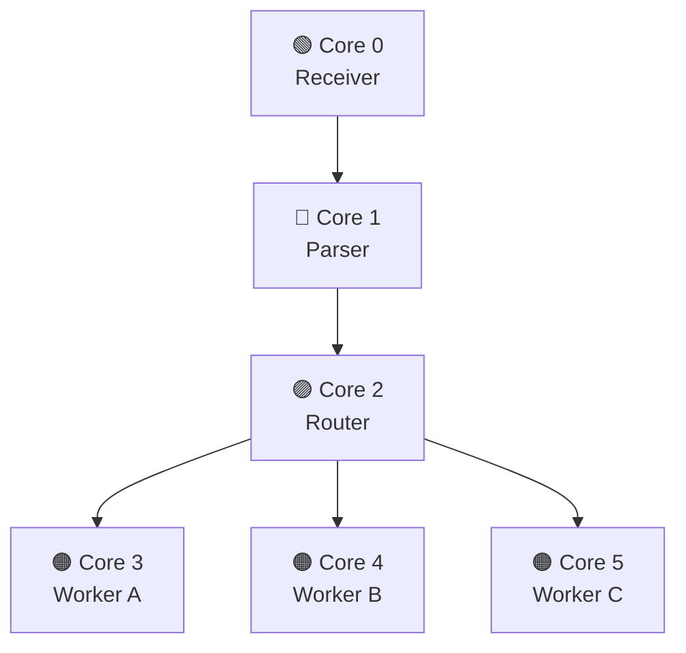
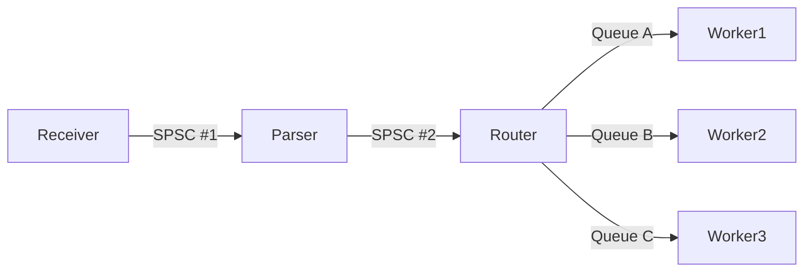
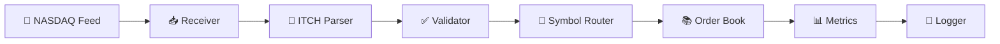

# 🚀 Mercury Architecture

> **Ultra-Low Latency NASDAQ ITCH Processing Framework**
>
> *Designed for deterministic execution, zero-copy parsing, lock-free communication, and cache-efficient memory layouts.*

---

# 📖 Table of Contents

- [System Overview](#-system-overview)
- [End-to-End Data Pipeline](#-end-to-end-data-pipeline)
- [CPU Affinity Model](#-cpu-affinity-model)
- [Memory Architecture](#-memory-architecture)
- [Cache Layout](#-cache-layout)
- [Queue Topology](#-queue-topology)
- [Timestamp Engine](#-timestamp-engine)
- [Latency Budget](#-latency-budget)
- [Design Principles](#-design-principles)

---

# 🏗 System Overview



---

# 🔄 End-to-End Data Pipeline



---

# 🧵 CPU Affinity Model



Every pipeline stage is pinned using

```cpp
sched_setaffinity()
```

Benefits

- ✅ Eliminates scheduler migration
- ✅ Preserves warm L1/L2 caches
- ✅ Reduces TLB invalidations
- ✅ Improves latency determinism

---

# 📦 Memory Architecture


### Allocation Policy

- Memory allocated during startup
- No runtime malloc/new
- Fixed-capacity ring buffers
- Parser scratch buffers reused
- Cache-line aligned objects
- Worker-local storage

---

# 🧠 Cache Layout

```text
┌──────────────────────────────────────────────────────────────┐
│                    64 Byte Cache Line                        │
├──────────────────────────────────────────────────────────────┤
│ Timestamp │ Symbol │ Price │ Qty │ Type │ Flags │ Padding   │
└──────────────────────────────────────────────────────────────┘
```

Every `MarketEvent`

- occupies exactly one cache line
- avoids false sharing
- minimizes cache misses
- improves memory locality

---

# 🔒 Queue Topology



Each queue is

- Lock-Free
- Bounded
- Single Producer
- Single Consumer
- Wait-Free enqueue/dequeue
- Acquire-Release atomics

---

# ⏱ Timestamp Engine


Mercury calibrates `__rdtsc()` during startup.

Runtime timestamps require only a single CPU instruction.

---

# ⚡ Latency Budget

| Stage | Target | Description |
|---------|---------:|------------|
| 📥 Receive | 50 ns | Header stripping |
| 📖 Parse | 120 ns | ITCH decoding |
| ✅ Validate | 80 ns | Length & sequence checks |
| 🔀 Route | 60 ns | Symbol hashing |
| 📚 Worker | 150 ns | Order book update |
| **Pipeline P99** | **<500 ns** | Target latency |

---

# 🎯 Design Principles

## 🚫 Zero-Copy Parsing

```text
Packet Bytes
      │
      ▼
std::span<const uint8_t>
      │
      ▼
Field Decode
      │
      ▼
MarketEvent
```

Incoming packets are never copied.

The parser references packet memory directly.

---

## 🔒 Lock-Free Communication

```text
Producer

      │

      ▼

┌─────────────────────────────┐

□□□□□□□□□□□□□□□□□□□□□□□□□□□□

└─────────────────────────────┘

      ▲

      │

Consumer
```

Properties

- Wait-Free
- Lock-Free
- Single Writer
- Single Reader
- Cache Friendly

---

## 📌 CPU Pinning

Every thread owns one dedicated CPU core.

Benefits

- Warm instruction cache
- Warm data cache
- Predictable execution
- Reduced context switching

---

## 🧠 Cache Locality

Each worker exclusively owns

- Order book
- Metrics
- Scratch buffers
- Temporary objects

No mutable state is shared between workers.

---

## ⚙️ Static Polymorphism

Mercury uses C++20 Concepts instead of virtual interfaces.

Advantages

- Zero virtual dispatch
- Better compiler inlining
- Smaller instruction footprint
- Improved optimization opportunities

---

## 📦 Memory Management

The hot path performs

- ❌ No malloc
- ❌ No new
- ❌ No delete
- ❌ No dynamic allocation

Everything is preallocated before processing begins.

---

# 📊 Performance Optimizations

| Optimization | Benefit |
|---------------|-----------------------------|
| 🚫 Zero Copy | Eliminates memcpy |
| 🔒 Lock-Free Queues | Removes mutex overhead |
| 📌 CPU Pinning | Prevents core migration |
| 🧠 Cache Alignment | Better cache utilization |
| ⚙️ C++20 Concepts | No virtual dispatch |
| ⏱ __rdtsc() | Ultra-fast timestamps |
| 📦 Preallocation | No runtime allocations |

---

# 📈 Complete Data Flow



---

# 🎯 Design Goals

| Goal | Status |
|--------|:------:|
| Zero Copy Parsing | ✅ |
| Lock-Free Communication | ✅ |
| Cache-Line Alignment | ✅ |
| CPU Affinity | ✅ |
| Deterministic Execution | ✅ |
| No Runtime Allocation | ✅ |
| C++20 Compile-Time Polymorphism | ✅ |
| Sub-Microsecond Pipeline | ✅ |

---

> **Mercury prioritizes deterministic latency over peak throughput.**
>
> Every architectural decision—from thread pinning and cache-line alignment to lock-free queues and zero-copy parsing—is designed to minimize jitter and deliver predictable performance under sustained market data loads.
