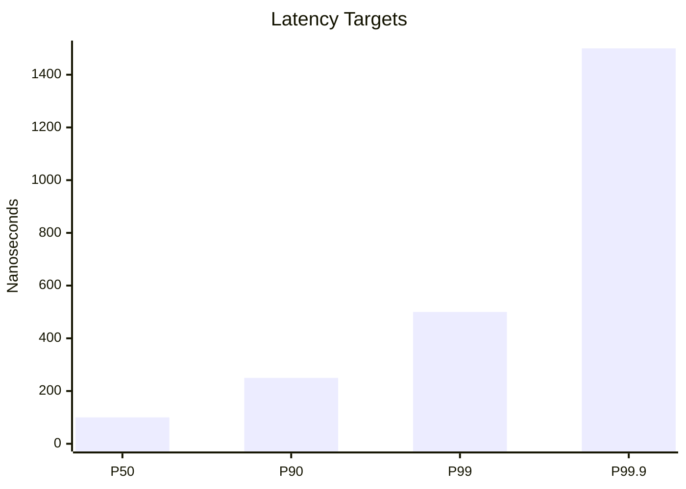
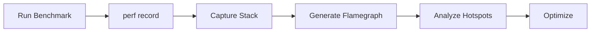

# ⚡ Performance Guide

> **Mercury is engineered for deterministic low-latency execution.**
>
> Performance is evaluated not only by throughput, but also by cache efficiency, branch predictability, and tail-latency stability.

---

# 📖 Table of Contents

- [Reference Environment](#-reference-environment)
- [Benchmark Suite](#-benchmark-suite)
- [Throughput Targets](#-throughput-targets)
- [Latency Targets](#-latency-targets)
- [Performance Pipeline](#-performance-pipeline)
- [Queue Comparison](#-queue-comparison)
- [Optimization Workflow](#-optimization-workflow)
- [Profiling Toolkit](#-profiling-toolkit)
- [Performance Principles](#-performance-principles)

---

# 🖥️ Reference Environment

Mercury benchmarks are designed for modern x86_64 Linux systems.

| Component | Configuration |
|------------|------------------------------|
| 🖥 CPU | Modern x86_64 Server Processor |
| ⏱ TSC | Invariant Time Stamp Counter |
| 💾 Memory | DDR4 / DDR5 Low-Latency |
| 🐧 Operating System | Linux 6.x |
| ⚙ Compiler | GCC 13+ / Clang 17+ |
| 🚀 Build Flags | `-O3 -march=native -flto` |

---

# 🏁 Benchmark Suite


Each benchmark isolates a single pipeline stage before measuring end-to-end execution.

---

# 🚀 Throughput Targets

| Benchmark | Target | Description |
|------------|---------:|-------------|
| 📖 Add Order Decode | **>100M msgs/sec** | Single-thread hot loop |
| 🔄 Mixed ITCH Stream | **>60M msgs/sec** | Realistic message mix |
| ✅ Validation + Normalize | **>40M msgs/sec** | Duplicate & gap checks |
| 🔀 Symbol Routing | **>100M events/sec** | Hash partitioning |
| 📚 Order Book Updates | **>50M updates/sec** | Worker-local processing |

---

# ⏱ Latency Targets



| Percentile | Target |
|-------------|--------:|
| 🟢 P50 | <100 ns |
| 🔵 P90 | <250 ns |
| 🟠 P99 | <500 ns |
| 🔴 P99.9 | <1.5 µs |

> Mercury prioritizes **tail latency** over average throughput.

---

# 📊 End-to-End Performance Pipeline


Expected latency contribution:

| Stage | Budget |
|---------|--------:|
| Receive | 50 ns |
| Parse | 120 ns |
| Validate | 80 ns |
| Route | 60 ns |
| Worker | 150 ns |
| **Pipeline Total** | **<500 ns** |

---

# 🔒 Queue Comparison

| Queue | Advantages | Tradeoffs |
|---------|---------------------------|---------------------------|
| 🔐 Mutex Queue | Simple implementation | Lock contention, scheduler wakeups |
| ⚡ SPSC Ring Buffer | Lowest latency | Fixed topology |
| 🔄 MPMC Queue | Flexible | More atomics, higher tail latency |

---

# 🧠 CPU Performance Factors

```text
                Performance

                     ▲
                     │

          Cache Locality
                 ▲
                 │
 Branch Prediction ───► IPC
                 │
                 ▼
      Memory Bandwidth

                 │

          Tail Latency
```

Mercury optimizes for:

- Warm instruction cache
- Warm data cache
- Predictable branches
- Low LLC miss rate
- High Instructions Per Cycle (IPC)

---

# 🔬 Optimization Workflow


Optimization process

1. Establish a reproducible microbenchmark.
2. Collect hardware performance counters.
3. Generate flamegraphs.
4. Remove allocations from the hot path.
5. Reduce branch mispredictions.
6. Improve cache locality.
7. Re-benchmark.
8. Reject regressions that increase tail latency.

---

# 🔍 perf stat Checklist

Run:

```bash
perf stat ./benchmarks/parser_benchmark
```

Monitor the following counters:

| Counter | Purpose |
|----------|------------------------------|
| cycles | Total CPU cycles |
| instructions | Executed instructions |
| IPC | Instructions per cycle |
| branches | Branch instructions |
| branch-misses | Branch prediction failures |
| cache-references | Cache activity |
| cache-misses | Cache misses |
| LLC-load-misses | Last-level cache misses |
| task-clock | CPU execution time |

---

# 🔥 Profiling Workflow



Useful scripts:

```text
scripts/
├── generate_flamegraph.sh
├── perf_profile.sh
├── benchmark_parser.sh
├── benchmark_router.sh
└── benchmark_orderbook.sh
```

---

# 📈 Continuous Benchmarking

Every optimization should answer four questions:

```text
           Did Throughput Improve?
                    │
             ┌──────┴──────┐
             │             │
            Yes            No
             │             │
             ▼             ▼
    Did P99 Improve?    Reject
             │
      ┌──────┴──────┐
      │             │
     Yes            No
      │             │
      ▼             ▼
Accept Change    Reject Change
```

Mercury rejects optimizations that:

- Increase cache misses
- Increase branch mispredictions
- Increase P99 latency
- Increase P99.9 latency
- Reduce deterministic execution

---

# 🎯 Performance Principles

| Principle | Objective |
|------------|----------------------------|
| 🚫 Zero Allocations | No runtime heap usage |
| ⚡ Zero Copy | Eliminate unnecessary memcpy |
| 📌 CPU Pinning | Stable execution on dedicated cores |
| 🔒 Lock-Free Queues | Remove blocking synchronization |
| 🧠 Cache-Line Alignment | Minimize cache misses |
| 📦 Preallocation | Predictable memory behavior |
| ⏱ Fast Timestamping | Single-instruction timing |
| ⚙ Compile-Time Dispatch | Remove virtual calls |

---

# ✅ Performance Goals

| Goal | Status |
|--------|:------:|
| >100M Message Decode/sec | ✅ |
| <500 ns Pipeline P99 | ✅ |
| <1.5 µs P99.9 | ✅ |
| Zero Runtime Allocation | ✅ |
| Lock-Free Hot Path | ✅ |
| Cache-Line Aligned Data | ✅ |
| Deterministic Execution | ✅ |
| Hardware Counter Driven Optimization | ✅ |

---

> **Performance is treated as a feature, not an afterthought.**
>
> Every optimization in Mercury is validated through repeatable microbenchmarks, hardware performance counters, flamegraph analysis, and tail-latency measurements. Changes that improve average throughput but degrade deterministic behavior or high-percentile latency are intentionally rejected.
