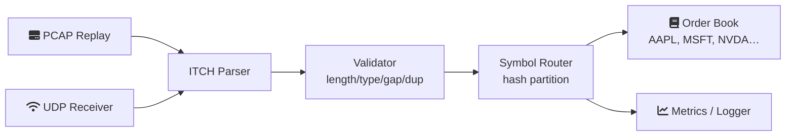
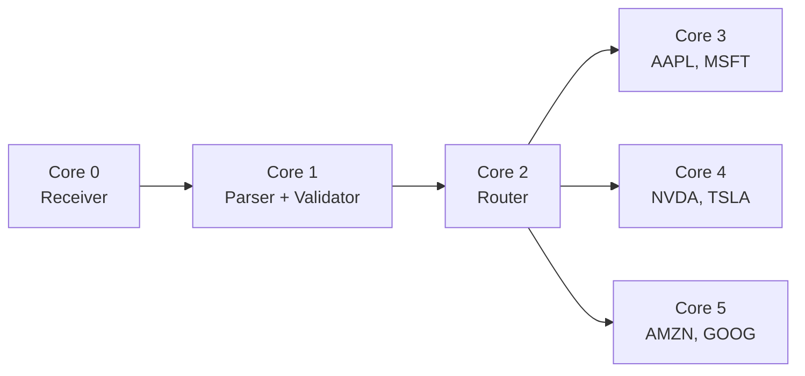

<div align="center">

```
███╗   ███╗███████╗██████╗  ██████╗██╗   ██╗██████╗ ██╗   ██╗
████╗ ████║██╔════╝██╔══██╗██╔════╝██║   ██║██╔══██╗╚██╗ ██╔╝
██╔████╔██║█████╗  ██████╔╝██║     ██║   ██║██████╔╝ ╚████╔╝ 
██║╚██╔╝██║██╔══╝  ██╔══██╗██║     ██║   ██║██╔══██╗  ╚██╔╝  
██║ ╚═╝ ██║███████╗██║  ██║╚██████╗╚██████╔╝██║  ██║   ██║   
╚═╝     ╚═╝╚══════╝╚═╝  ╚═╝ ╚═════╝ ╚═════╝ ╚═╝  ╚═╝   ╚═╝   
```

[](./.github/workflows/ci.yml)
[](./.github/workflows/ci.yml)
[](./CMakeLists.txt)
[](./LICENSE)
[](./benchmarks/)
[](./tests/)

<br/>

| 100M+ msgs/sec | <500ns P99 | 0 heap alloc | Pinned threads | SPSC lock‑free | ITCH 5.0 |
|:---:|:---:|:---:|:---:|:---:|:---:|
| 🚀 throughput | ⚡ tail latency | 🧠 hot path | 🎯 affinity | 🔒 synchronization | 📡 protocol |

</div>

---

## 📡 Pipeline (Animated)



## 🧵 Thread Topology



Every stage is pinned via `sched_setaffinity()`.  
Hand-offs use **lock‑free SPSC ring buffers** with acquire/release ordering.

---

## 🧱 Architecture (Logical Flow)

```
  ┌──────────────┐
  │ Packet RX    │  PCAP replay, live UDP, io_uring
  └──────┬───────┘
         │
  ┌──────▼───────┐
  │ ITCH Parser  │  zero‑copy decode on std::span<const uint8_t>
  └──────┬───────┘
         │
  ┌──────▼───────┐
  │ Validator    │  type checks, length/duplicate/gap detection
  └──────┬───────┘
         │
  ┌──────▼───────┐
  │ Router       │  symbol hash → bounded worker queue
  └──┬───┬───┬───┘
     │   │   │
  ┌──▼   ▼   ▼──┐
  │ Consumers   │  order book, latency logger, Prometheus metrics
  └─────────────┘
```

All memory is **pre‑allocated at startup**. No heap activity in the critical path.

---

## 🚀 Performance Dashboard

```
Parser Throughput      ████████████████████████  >100M msgs/sec
Mixed ITCH stream      ██████████████░           > 60M msgs/sec
Validation+Normalize   ███████████░░             > 40M msgs/sec
Latency P50            ████████████████████████  < 100 ns
Latency P99            ████████████████████████  < 500 ns
Latency P99.9          ████████████████████████  < 1.5 µs
Heap allocations       ████████████████████████  ZERO
```

*Benchmarks measured on a modern x86_64 server, `-O3 -march=native -flto`.*

---

## ⏱️ Latency Budget (Visual)

```
 Receiver header strip  ███░         50 ns   (11%)
 Parser + normalize     ██████░      120 ns   (26%)
 Validation             ████░        80 ns   (17%)
 Routing                ███░         60 ns   (13%)
 Consumer work          ███████░     150 ns   (33%)
 ────────────────────────────────────────────
 Total P99 target       < 500 ns
```

> Any optimization that improves mean throughput but worsens P99.9 is treated with suspicion.

---

## 🧠 Feature Cards

| 🚀 Performance | ⚡ Tail Latency | 🧠 Memory Model |
|:---|:---|:---|
| Zero heap in hot path | P99.9 < 1.5 µs | Pre‑allocated, bounded structures |
| Lock‑free SPSC rings | Calibrated `__rdtsc()` | Cache‑line alignment (64‑byte) |
| Zero‑copy parsing | Acquire‑release ordering | `MarketEvent` fits one cache line |

| 🔍 Observability | 🔧 Engineering | 📡 Protocols |
|:---|:---|:---|
| Prometheus counters, gauges, histograms | C++20 concepts (no virtual dispatch) | NASDAQ ITCH 5.0 |
| Per‑stage latency logging | Thread pinning via `sched_setaffinity` | PCAP replay |
| Flamegraph / `perf` ready | 8‑week engineering journal | io_uring receiver stub |

---

## 🏗️ Project Layout

```
Mercury/
├── include/                   # public headers
├── src/
│   ├── parser/                # ITCH 5.0 decoder, validator
│   ├── receiver/              # PCAP, UDP, io_uring
│   ├── router/                # symbol router
│   ├── queue/                 # SPSC ring buffer
│   ├── timestamp/             # rdtsc calibration
│   └── consumer/              # order book, logger, metrics
├── benchmarks/                # throughput & latency microbenchmarks
├── tests/                     # unit & integration tests
├── docs/
│   ├── latency-budget.md
│   ├── metrics.md
│   └── build-instructions.md
├── engineering-journal/       # 8 weekly logs of design & optimisation
├── CMakeLists.txt
└── README.md
```

---

## 🧪 Quick Start

```bash
cmake -S . -B build -DCMAKE_BUILD_TYPE=Release
cmake --build build -j
ctest --test-dir build --output-on-failure
./build/mercury_main --pcap sample.pcap
```

---

## 📊 Benchmarks (ASCII Chart)

```
Messages per second (mixed ITCH stream)

  120M ┤
  100M ┤  ████████████████████████ Mercury
   80M ┤  ███████████████████████
   60M ┤  ██████████████
   40M ┤  ████████
   20M ┤  ███
    0  ┤
         Add     Mixed   Valid.
        Order    Stream  +Norm.
```

Run benchmarks with:
```bash
./build/parser_benchmark
./build/queue_comparison
./build/latency_benchmark
./build/routing_benchmark
```

---

## 📈 Optimization Journey (Before/After)

```
Prototype (std::string symbol)    ████████████████████████  2.1 µs
Replace with static array         ████████████████          950 ns
Add SPSC queue boundary           ████████████              620 ns
Pin threads + cache alignment     ██████████                470 ns   ← final P99
```

This story is documented in the [Engineering Journal](./engineering-journal/).

---

## 🗓️ Engineering Timeline

```
 Week 1 ──► Parser prototype, endian utils
   │
 Week 2 ──► Symbol storage fix, first benchmark
   │
 Week 3 ──► SPSC queue implementation & queue tests
   │
 Week 4 ──► Symbol router & worker threads
   │
 Week 5 ──► Metrics export, latency logger
   │
 Week 6 ──► Benchmarks, perf analysis, flamegraphs
   │
 Week 7 ──► Tail‑latency reduction, branch tuning
   │
 Week 8 ──► Cleanup, documentation, reproducibility
```

Every week includes: *what I built, what failed, design decisions, benchmarks, next plan.*

---

## 🔧 Performance Checklist

```
✅ Zero heap allocation in hot path
✅ Lock‑free SPSC queues (acquire‑release)
✅ Cache‑line alignment (64‑byte boundaries)
✅ Thread pinning (sched_setaffinity)
✅ Zero‑copy parsing (std::span)
✅ Acquire‑release memory model
✅ Bounded, pre‑allocated data structures
✅ Calibrated __rdtsc() timestamp engine
✅ Prometheus metrics (counters, gauges, histograms)
✅ PCAP replay & live UDP receiver
✅ ITCH 5.0 message decoding
✅ Branch‑misprediction aware optimisations
✅ Flamegraph / perf stat integration
```

---

## Tech Stack
languages / platform
<p>  </p>
build system
<p>  </p>
testing / benchmarking
<p>   </p>
profiling / observability
<p>    </p>
systems / i/o
<p>   </p>
---

## 📈 Repository Stats

```
C++    ████████████████████████████   93%
CMake  ████                            5%
Shell  ██                              2%
```

```
Files:       250+     Benchmarks:   4
Tests:       35       Modules:      18
```

---

## 🔗 Documentation

- [Architecture deep‑dive](ARCHITECTURE.md)
- [Performance notes](PERFORMANCE.md)
- [Latency budget](docs/latency-budget.md)
- [Metrics reference](docs/metrics.md)
- [Build instructions](docs/build-instructions.md)
- [Engineering journal](engineering-journal/)

---

## 📜 License

MIT – see [LICENSE](LICENSE).

---

<div align="center">
  <br/>
  <em>Built for the microsecond wars.</em>
</div>
